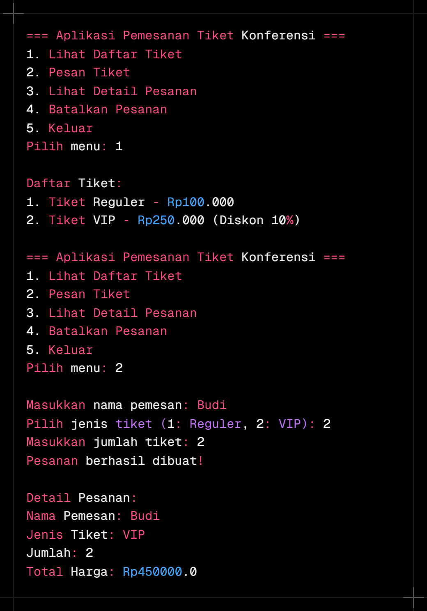

LAPORAN PRAKTIKUM PEMROGRAMAN BERORIENTASI OBJEK (PBO)
**Materi: Modul 2 KONSEP DASAR OOP MENGGUNAKAN JAVA

**Nama:** Muhammad Habib Hanafi

**NIM:** 2024573010093

**Kelas:** TI 2A

### 1.1 Latar Belakang
Pemrograman Berorientasi Objek (Object-Oriented Programming atau OOP) merupakan paradigma pemrograman yang berorientasi kepada objek. Berbeda dengan pemrograman prosedural yang berfokus pada urutan instruksi, OOP memodelkan sistem berdasarkan objek-objek nyata yang memiliki atribut (data) dan perilaku (method).

Di dalam Modul 2 ini, fokus utama adalah pada pilar pertama OOP, yaitu **Encapsulation** (Pengapsulan). Konsep ini sangat krusial dalam pengembangan perangkat lunak modern untuk menjaga integritas data dan menyembunyikan kompleksitas internal sebuah class dari akses luar yang tidak sah.

### 1.2 Tujuan Praktikum
Adapun tujuan dari pelaksanaan praktikum pada Modul 2 ini adalah:
1. Memahami konsep **Data Hiding** melalui penggunaan *access modifier* (private, public, protected).
2. Mampu mengimplementasikan method **Getter** dan **Setter** untuk mengelola akses atribut secara terkontrol.
3. Memahami pentingnya validasi data di dalam method setter untuk mencegah input yang tidak valid.
4. Menerapkan standar penulisan class Java yang rapi dan modular.

### 1.3 Manfaat
Dengan menguasai materi pada modul ini, praktikan diharapkan mampu membangun struktur kode yang lebih aman (*secure*) dan mudah dikelola (*maintainable*), yang menjadi fondasi dasar sebelum melangkah ke konsep yang lebih kompleks seperti Inheritance dan Polymorphism pada modul berikutnya.

### langkah praktikum

### Class dan Objek
Latihan
Buatlah class Buku dengan atribut judul dan pengarang.
Buat object dari class Buku dan isi nilai atributnya.
Tampilkan nilai atribut tersebut.

kode: class Buku
package modul_2.latihan;

public class Buku {
// Atribut (Data)
String judul;
String pengarang;
}

kode: class MainBuku
package modul_2.latihan;

public class MainBuku {
public static void main(String[] args) {
// 1. Membuat object dari class Buku
Buku buku1 = new Buku();

        // 2. Mengisi nilai atribut secara langsung
        buku1.judul = "Laskar Pelangi";
        buku1.pengarang = "Andrea Hirata";

        // 3. Tampilkan nilai atribut tersebut
        System.out.println("=== Detail Buku ===");
        System.out.println("Judul     : " + buku1.judul);
        System.out.println("Pengarang : " + buku1.pengarang);
    }
}
hasil

### Atribute dan Method
Latihan
Buat class Lingkaran dengan atribut jariJari.
Tambahkan method hitungLuas() yang mengembalikan nilai luas lingkaran.
Buat object dari class Lingkaran dan panggil method hitungLuas().

kode: class Lingkaran
package modul_2.latihan;

public class Lingkaran {
// Atribut
double jariJari;

    // Method untuk menghitung luas lingkaran
    // Rumus: Luas = PI * r * r
    double hitungLuas() {
        return 3.14 * jariJari * jariJari;
    }
}

kode: class MainLingkaran
package modul_2.latihan;

public class MainLingkaran {
public static void main(String[] args) {
// 1. Membuat object dari class Lingkaran
Lingkaran bundar = new Lingkaran();

        // 2. Mengisi nilai atribut jari-jari
        bundar.jariJari = 7;

        // 3. Memanggil method hitungLuas() dan menampilkan hasilnya
        double hasilLuas = bundar.hitungLuas();
        System.out.println("Jari-jari lingkaran: " + bundar.jariJari);
        System.out.println("Luas Lingkaran     : " + hasilLuas);
    }
}

hasil

### Akses Modifier
Akses Modifier menentukan tingkat akses dari class, atribut, atau method.
Jenis akses modifier:
public : Dapat diakses dari mana saja.
private : Hanya dapat diakses dalam class yang sama.
protected : Dapat diakses dalam package yang sama dan subclass.
default : Hanya dapat diakses dalam package yang sama.

Latihan
Buat class AkunBank dengan atribut saldo (private) dan method tampilkanSaldo() (public).
Coba akses atribut saldo langsung dari luar class. Apa yang terjadi?

kode: class AkunBank
package modul_2.latihan;

public class AkunBank {
// Atribut diproteksi dengan modifier private
private double saldo;

    // Constructor untuk mengisi saldo awal
    public AkunBank(double saldoAwal) {
        this.saldo = saldoAwal;
    }

    // Method public untuk menampilkan saldo
    public void tampilkanSaldo() {
        System.out.println("Saldo saat ini: Rp" + saldo);
    }
}

kode: class MainBank
package modul_2.latihan;

public class MainBank {
public static void main(String[] args) {
AkunBank tabunganHabib = new AkunBank(500000);

        // 1. Memanggil method public (Berhasil)
        tabunganHabib.tampilkanSaldo();

        // 2. Mencoba akses atribut saldo langsung (Akan Error)
        // System.out.println(tabunganHabib.saldo); 
        
        /* CATATAN: Baris di atas jika tidak dikomentari akan menyebabkan 
           compile-time error: 'saldo has private access in AkunBank'
        */
    }
}
hasil

### Setter dan Getter
Setter adalah method untuk mengubah nilai atribut.
Getter adalah method untuk mengambil nilai atribut.
Setter dan Getter digunakan untuk mengakses atribut yang memiliki akses modifier private.

Latihan
Buat class Mahasiswa dengan atribut nama (private) dan nim (private).
Buat setter dan getter untuk kedua atribut tersebut.
Buat object dari class Mahasiswa dan gunakan setter untuk mengisi nilai atribut.

kode: class Mahasiswa
package modul_2.latihan;

public class Mahasiswa {
// Atribut private (Data Hiding)
private String nama;
private String nim;

    // Setter untuk atribut nama
    public void setNama(String nama) {
        this.nama = nama;
    }

    // Getter untuk atribut nama
    public String getNama() {
        return nama;
    }

    // Setter untuk atribut nim
    public void setNim(String nim) {
        this.nim = nim;
    }

    // Getter untuk atribut nim
    public String getNim() {
        return nim;
    }
}

kode: class MainMahasiswa
package modul_2.latihan;

public class MainMahasiswa {
public static void main(String[] args) {
// 1. Membuat object
Mahasiswa mhs = new Mahasiswa();

        // 2. Mengisi nilai menggunakan SETTER
        mhs.setNama("Muhammad Habib");
        mhs.setNim("202200123");

        // 3. Mengambil nilai menggunakan GETTER
        System.out.println("=== Data Mahasiswa ===");
        System.out.println("Nama : " + mhs.getNama());
        System.out.println("NIM  : " + mhs.getNim());
    }
}
hasil

### Constructor
Constructor adalah method khusus yang dipanggil saat object dibuat.
Jenis constructor:
Default Constructor : Tanpa parameter.
Parameterized Constructor : Dengan parameter.
Constructor Overloading : Beberapa constructor dengan parameter berbeda.

Latihan
Buat class Barang dengan atribut namaBarang dan harga.
Buat default constructor dan parameterized constructor.
Buat object dari class Barang menggunakan kedua constructor tersebut.

kode: class Barang
package modul_2.latihan;

public class Barang {
String namaBarang;
double harga;

    // 1. Default Constructor (Tanpa Parameter)
    public Barang() {
        this.namaBarang = "Belum diisi";
        this.harga = 0;
    }

    // 2. Parameterized Constructor (Dengan Parameter)
    public Barang(String nama, double harga) {
        this.namaBarang = nama;
        this.harga = harga;
    }

    void tampilkanInfo() {
        System.out.println("Barang: " + namaBarang + " | Harga: Rp" + harga);
    }
}

kode: class MainBarang
package modul_2.latihan;

public class MainBarang {
public static void main(String[] args) {
// Menggunakan Default Constructor
Barang barang1 = new Barang();

        // Menggunakan Parameterized Constructor
        Barang barang2 = new Barang("Laptop HP ProBook", 7500000);

        System.out.println("=== Info Barang ===");
        barang1.tampilkanInfo();
        barang2.tampilkanInfo();
    }
}
hasil

### Sistem Manajemen Perpustakaan Sederhana
program konsol sederhana yang mengimplementasikan seluruh konsep yang telah dibahas sebelumnya, yaitu class, object, attribute, method, akses modifier, setter-getter, dan constructor. Program ini adalah sistem manajemen perpustakaan sederhana yang memungkinkan pengguna untuk menambahkan buku, menampilkan daftar buku, dan mencari buku berdasarkan judul.

contoh program
kode: class Buku
package modul_2.bagian_6;

public class Buku {
// Atribut (private)
private String judul;
private String pengarang;
private int tahunTerbit;

    // Constructor (default)
    public Buku() {
        this.judul = "Unknown";
        this.pengarang = "Unknown";
        this.tahunTerbit = 0;
    }

    // Constructor (parameterized)
    public Buku(String judul, String pengarang, int tahunTerbit) {
        this.judul = judul;
        this.pengarang = pengarang;
        this.tahunTerbit = tahunTerbit;
    }

    // Setter dan Getter
    public void setJudul(String judul) {
        this.judul = judul;
    }

    public String getJudul() {
        return judul;
    }

    public void setPengarang(String pengarang) {
        this.pengarang = pengarang;
    }

    public String getPengarang() {
        return pengarang;
    }

    public void setTahunTerbit(int tahunTerbit) {
        this.tahunTerbit = tahunTerbit;
    }

    public int getTahunTerbit() {
        return tahunTerbit;
    }

    // Method untuk menampilkan informasi buku
    public void tampilkanInfo() {
        System.out.println("Judul: " + judul);
        System.out.println("Pengarang: " + pengarang);
        System.out.println("Tahun Terbit: " + tahunTerbit);
        System.out.println("------------------------------------");
    }
}

kode: class Perpustakaan
package modul_2.bagian_6;

import java.util.ArrayList;

public class Perpustakaan {
// Atribut private menggunakan ArrayList untuk menampung banyak objek Buku
private ArrayList<Buku> daftarBuku;

    // Constructor untuk inisialisasi ArrayList
    public Perpustakaan() {
        daftarBuku = new ArrayList<>();
    }

    // Method untuk menambahkan buku ke dalam list
    public void tambahBuku(Buku buku) {
        daftarBuku.add(buku);
        System.out.println("Buku berhasil ditambahkan!");
    }

    // Method untuk menampilkan semua buku yang ada
    public void tampilkanSemuaBuku() {
        if (daftarBuku.isEmpty()) {
            System.out.println("Tidak ada buku dalam perpustakaan.");
        } else {
            System.out.println("Daftar Buku:");
            for (Buku buku : daftarBuku) {
                buku.tampilkanInfo();
            }
        }
    }

    // Method untuk mencari buku berdasarkan judul
    public void cariBuku(String judul) {
        boolean ditemukan = false;
        for (Buku buku : daftarBuku) {
            if (buku.getJudul().equalsIgnoreCase(judul)) {
                System.out.println("Buku ditemukan:");
                buku.tampilkanInfo();
                ditemukan = true;
                break;
            }
        }
        if (!ditemukan) {
            System.out.println("Buku dengan judul \"" + judul + "\" tidak ditemukan.");
        }
    }
}

kode: class Main
package modul_2.bagian_6;

import java.util.Scanner;

public class Main {
public static void main(String[] args) {
Scanner scanner = new Scanner(System.in);
Perpustakaan perpustakaan = new Perpustakaan();
int pilihan;

        do {
            // Menu Interaktif
            System.out.println("\n=== Sistem Manajemen Perpustakaan ===");
            System.out.println("1. Tambah Buku");
            System.out.println("2. Tampilkan Semua Buku");
            System.out.println("3. Cari Buku");
            System.out.println("4. Keluar");
            System.out.print("Pilih menu: ");
            pilihan = scanner.nextInt();
            scanner.nextLine(); // Membersihkan newline

            switch (pilihan) {
                case 1:
                    // Tambah Buku
                    System.out.print("Masukkan judul buku: ");
                    String judul = scanner.nextLine();
                    System.out.print("Masukkan nama pengarang: ");
                    String pengarang = scanner.nextLine();
                    System.out.print("Masukkan tahun terbit: ");
                    int tahunTerbit = scanner.nextInt();
                    scanner.nextLine(); // Membersihkan newline

                    Buku bukuBaru = new Buku(judul, pengarang, tahunTerbit);
                    perpustakaan.tambahBuku(bukuBaru);
                    break;

                case 2:
                    // Tampilkan Semua Buku
                    perpustakaan.tampilkanSemuaBuku();
                    break;

                case 3:
                    // Cari Buku
                    System.out.print("Masukkan judul buku yang dicari: ");
                    String judulCari = scanner.nextLine();
                    perpustakaan.cariBuku(judulCari);
                    break;

                case 4:
                    // Keluar
                    System.out.println("Terima kasih telah menggunakan sistem ini!");
                    break;

                default:
                    System.out.println("Pilihan tidak valid. Silakan coba lagi.");
            }
        } while (pilihan != 4);

        scanner.close();
    }
}

hasil

### LAPORAN 3 Review 4 pilar OOP
Pengenalan OOP dan Class-Object
OOP (Object-Oriented Programming) adalah paradigma pemrograman yang menggunakan "objek" untuk merepresentasikan data dan metode yang beroperasi pada data tersebut. Konsep dasar OOP:

Class: Blueprint atau template untuk membuat objek.
Object: Instance dari class yang memiliki atribut dan metode.

Latihan
Buat class Buku dengan atribut judul, penulis, dan tahunTerbit.
Buat objek dari class Buku dan tampilkan informasinya.

kode: class
package modul_3.bagian_1;

public class Buku {
// Atribut
String judul;
String penulis;
int tahunTerbit;

    // Metode untuk menampilkan informasi
    void tampilkanInfo() {
        System.out.println("Judul Buku    : " + judul);
        System.out.println("Penulis       : " + penulis);
        System.out.println("Tahun Terbit  : " + tahunTerbit);
    }
}

kode: class MainBuku
package modul_2.latihan;

public class MainBukuDasar {
public static void main(String[] args) {
// 1. Membuat objek dari class BukuDasar
BukuDasar bukuHabib = new BukuDasar();

        // 2. Mengisi nilai atribut
        bukuHabib.judul = "Laskar Pelangi";
        bukuHabib.penulis = "Andrea Hirata";
        bukuHabib.tahunTerbit = 2005;

        // 3. Menampilkan informasi objek
        System.out.println("=== Informasi Buku ===");
        bukuHabib.tampilkanInfo();
    }
}
hasil

### Encapsulation 
Encapsulation adalah konsep menyembunyikan detail internal objek dan hanya mengekspos fungsionalitas yang diperlukan. Ini dilakukan dengan menggunakan access modifier (private, public, protected) dan getter-setter

Latihan
Buat class Motor dengan atribut merk dan tahun yang dienkapsulasi.
Buat getter dan setter untuk atribut tersebut.

kode: class Motor
package modul_2.latihan;

public class Motor {
// Atribut yang dienkapsulasi (private)
private String merk;
private int tahun;

    // Getter untuk merk
    public String getMerk() {
        return merk;
    }

    // Setter untuk merk
    public void setMerk(String merk) {
        this.merk = merk;
    }

    // Getter untuk tahun
    public int getTahun() {
        return tahun;
    }

    // Setter untuk tahun
    public void setTahun(int tahun) {
        // Contoh validasi sederhana: tahun tidak boleh negatif
        if (tahun > 0) {
            this.tahun = tahun;
        } else {
            System.out.println("Tahun tidak valid!");
        }
    }
}

kode: class MainMotor
package modul_2.latihan;

public class MainMotor {
public static void main(String[] args) {
// 1. Membuat objek motor
Motor motorHabib = new Motor();

        // 2. Mengisi nilai menggunakan SETTER
        motorHabib.setMerk("Honda Vario");
        motorHabib.setTahun(2024);

        // 3. Menampilkan nilai menggunakan GETTER
        System.out.println("=== Detail Motor ===");
        System.out.println("Merk  : " + motorHabib.getMerk());
        System.out.println("Tahun : " + motorHabib.getTahun());
    }
}
hasil

### Inheritance
Dalam pemrograman berorientasi objek (OOP), Inheritance dan Composition adalah dua konsep penting yang digunakan untuk membangun hubungan antara class. Meskipun keduanya memiliki tujuan yang sama, yaitu mempromosikan reuseability (penggunaan kembali kode) dan modularitas, mereka memiliki pendekatan yang berbeda. Berikut adalah penjelasan lengkap tentang Composition dan perbandingannya dengan Inheritance.

Inheritance (Pewarisan)
Inheritance adalah mekanisme di mana sebuah class (subclass/child class) mewarisi atribut dan metode dari class lain (superclass/parent class). Inheritance menggambarkan hubungan "is-a" (adalah). Misalnya, Kucing adalah Hewan.

Ciri-Ciri Inheritance:
Menggunakan keyword extends.
Subclass mewarisi semua atribut dan metode dari superclass (kecuali yang private).
Subclass dapat menambahkan atribut dan metode baru, atau meng-override metode yang ada.
Mendukung hierarki class (class dapat mewarisi dari satu superclass).

kode: class Kendaraan
package modul_3.latihan;

class Kendaraan {
String merk;
int tahun;

    void displayInfo() {
        System.out.println("Merk: " + merk);
        System.out.println("Tahun: " + tahun);
    }
}

kode: class Mobil
package modul_3.latihan;

class Mobil extends Kendaraan {
int jumlahPintu;

    void displayInfoMobil() {
        displayInfo(); // Memanggil metode dari superclass
        System.out.println("Jumlah Pintu: " + jumlahPintu);
    }
}

kode: class Main
package modul_3.latihan;

public class Main {
public static void main(String[] args) {
// Membuat objek dari subclass Mobil
Mobil mobil1 = new Mobil();

        // Mengisi atribut yang diwarisi dari superclass
        mobil1.merk = "Toyota";
        mobil1.tahun = 2021;

        // Mengisi atribut asli milik subclass
        mobil1.jumlahPintu = 4;

        // Memanggil method untuk menampilkan informasi lengkap
        mobil1.displayInfoMobil();
    }
}
hasil

### Composition (Komposisi)
Composition adalah mekanisme di mana sebuah class terdiri dari objek-objek dari class lain. Ini menggambarkan hubungan "has-a" (memiliki). Misalnya, Mobil memiliki Mesin. Composition memungkinkan kita untuk membangun class yang kompleks dengan menggabungkan objek-objek yang lebih sederhana.

Ciri-Ciri Composition:
Menggunakan instance variabel dari class lain.
Tidak ada keyword khusus, hanya menggunakan objek sebagai atribut.
Lebih fleksibel daripada inheritance karena tidak terikat pada hierarki class.
Mendukung reuseability tanpa perlu mewarisi class.

langkah praktikum
kode: class Mesin
package modul_3.latihan;

class Mesin {
void hidupkan() {
System.out.println("Mesin menyala.");
}

    void matikan() {
        System.out.println("Mesin dimatikan.");
    }
}
kode: class
package modul_3.latihan;

class Mobil {
private final Mesin mesin; // Composition

    public Mobil() {
        this.mesin = new Mesin(); // Membuat objek Mesin saat Mobil dibuat
    }

    void mulai() {
        mesin.hidupkan();
        System.out.println("Mobil siap digunakan.");
    }

    void berhenti() {
        mesin.matikan();
        System.out.println("Mobil berhenti.");
    }
}

kode: class Main
package modul_3.latihan;

public class Main {
public static void main(String[] args) {
// Membuat satu objek Mobil (otomatis membuat objek Mesin di dalamnya)
Mobil mobil = new Mobil();

        // Menjalankan method yang mendelegasikan perintah ke objek Mesin
        mobil.mulai();
        
        // Menghentikan operasional mobil dan mesin
        mobil.berhenti();
    }
}
hasil 

### Polymorphism (Polimorfisme)
Polymorphism memungkinkan objek untuk memiliki banyak bentuk. Ini dapat dicapai melalui method overriding (mengganti metode di subclass) dan method overloading (beberapa metode dengan nama sama tetapi parameter berbeda).

Method Overriding
Method overriding terjadi ketika subclass (class anak) menyediakan implementasi spesifik untuk method yang sudah didefinisikan di superclass (class induk). Method overriding digunakan untuk mengubah atau memperluas perilaku method yang diwarisi dari superclass. Method yang di-override harus memiliki nama, parameter, dan return type yang sama dengan method di superclass.

Aturan Method Overriding:
Method harus memiliki nama dan parameter yang sama dengan method di superclass.
Return type harus sama atau subtype dari return type di superclass.
Access modifier tidak boleh lebih restriktif daripada method di superclass (misalnya, jika method di superclass protected, method di subclass bisa protected atau public).
Method tidak bisa di-override jika di superclass dideklarasikan sebagai final.

langkah praktikum
kode: class Hewan
package modul_3.latihan;

class Hewan {
void bersuara() {
System.out.println("Hewan bersuara.");
}

kode: class Kucing
package modul_3.latihan;

class Kucing extends Hewan {
@Override
void bersuara() {
System.out.println("Meong!");
}
}

kode: class Anjing
package modul_3.latihan;

class Anjing extends Hewan {
@Override
void bersuara() {
System.out.println("Guk Guk!");
}
}

kode: class Main
package modul_3.latihan;

public class Main {
public static void main(String[] args) {
// Deklarasi menggunakan tipe Superclass (Polymorphism)
Hewan hewan1 = new Kucing();
Hewan hewan2 = new Anjing();

        // Pemanggilan method yang sama menghasilkan output berbeda
        hewan1.bersuara(); // Output: Meong!
        hewan2.bersuara(); // Output: Guk Guk!
    }
}
hasil

### Aplikasi Console Pemesanan Tiket Sederhana
Berikut adalah contoh aplikasi console pemesanan tiket untuk sebuah konferensi yang mengimplementasikan seluruh konsep OOP (Class, Object, Encapsulation, Inheritance, Polymorphism, dan Abstraction). Aplikasi ini memiliki fitur lengkap seperti:

Menampilkan daftar tiket yang tersedia.
Memesan tiket.
Melihat detail pesanan.
Membatalkan pesanan.
Menghitung total harga.
Menerapkan diskon berdasarkan jenis tiket.
Dapat memiliki atribut, method konkret, dan method abstrak.
Method abstrak tidak memiliki body (hanya deklarasi).
Subclass yang mewarisi abstract class harus mengimplementasikan semua method abstrak (kecuali subclass tersebut juga abstract).

kode: class package modul_3.studi_kasus;

abstract class Tiket {
private final String jenis;
private final double harga;

    public Tiket(String jenis, double harga) {
        this.jenis = jenis;
        this.harga = harga;
    }

    public String getJenis() {
        return jenis;
    }

    public double getHarga() {
        return harga;
    }

    // Abstract method untuk menghitung diskon
    // Wajib diimplementasikan oleh subclass
    public abstract double hitungDiskon();
}
kode: class TikerReguler
package modul_3.studi_kasus;

class TiketReguler extends Tiket {
public TiketReguler() {
// Memanggil constructor superclass dengan nilai spesifik
super("Reguler", 100000); // Harga tiket reguler Rp100.000
}

    @Override
    public double hitungDiskon() {
        return 0; // Tidak ada diskon untuk tiket reguler
    }
}

kode: class TiketVIP
package modul_3.studi_kasus;

class TiketVIP extends Tiket {
public TiketVIP() {
// Mengirim data kategori dan harga dasar ke superclass
super("VIP", 250000); // Harga tiket VIP Rp250.000
}

    @Override
    public double hitungDiskon() {
        // Implementasi diskon 10% khusus untuk VIP
        return 0.1 * getHarga();
    }
}

kode: class Pesanan
package modul_3.studi_kasus;

class Pesanan {
private final String namaPemesan;
private final Tiket tiket;
private final int jumlah;

    public Pesanan(String namaPemesan, Tiket tiket, int jumlah) {
        this.namaPemesan = namaPemesan;
        this.tiket = tiket;
        this.jumlah = jumlah;
    }

    public String getNamaPemesan() {
        return namaPemesan;
    }

    public Tiket getTiket() {
        return tiket;
    }

    public int getJumlah() {
        return jumlah;
    }

    // Menghitung total harga setelah diskon
    public double hitungTotal() {
        double total = tiket.getHarga() * jumlah;
        double diskon = tiket.hitungDiskon() * jumlah;
        return total - diskon;
    }

    // Menampilkan detail pesanan
    public void displayDetail() {
        System.out.println("\nDetail Pesanan:");
        System.out.println("Nama Pemesan: " + namaPemesan);
        System.out.println("Jenis Tiket: " + tiket.getJenis());
        System.out.println("Jumlah     : " + jumlah);
        System.out.println("Total Harga: Rp" + hitungTotal());
    }
}

kode: class KonferensiApp
package modul_3.studi_kasus;

import java.util.ArrayList;
import java.util.Scanner;

public class KonferensiApp {
private static final ArrayList<Pesanan> daftarPesanan = new ArrayList<>();
private static final Scanner scanner = new Scanner(System.in);

    public static void main(String[] args) {
        while (true) {
            System.out.println("\n=== Aplikasi Pemesanan Tiket Konferensi ===");
            System.out.println("1. Lihat Daftar Tiket");
            System.out.println("2. Pesan Tiket");
            System.out.println("3. Lihat Detail Pesanan");
            System.out.println("4. Batalkan Pesanan");
            System.out.println("5. Keluar");
            System.out.print("Pilih menu: ");
            int pilihan = scanner.nextInt();
            scanner.nextLine(); // Membersihkan newline

            switch (pilihan) {
                case 1: lihatDaftarTiket(); break;
                case 2: pesanTiket(); break;
                case 3: lihatDetailPesanan(); break;
                case 4: batalkanPesanan(); break;
                case 5:
                    System.out.println("Terima kasih telah menggunakan aplikasi ini!");
                    System.exit(0);
                default:
                    System.out.println("Pilihan tidak valid. Silakan coba lagi.");
            }
        }
    }

    private static void lihatDaftarTiket() {
        System.out.println("\nDaftar Tiket:");
        System.out.println("1. Tiket Reguler - Rp100.000");
        System.out.println("2. Tiket VIP - Rp250.000 (Diskon 10%)");
    }

    private static void pesanTiket() {
        System.out.print("\nMasukkan nama pemesan: ");
        String namaPemesan = scanner.nextLine();
        System.out.print("Pilih jenis tiket (1: Reguler, 2: VIP): ");
        int jenisTiket = scanner.nextInt();
        System.out.print("Masukkan jumlah tiket: ");
        int jumlah = scanner.nextInt();

        Tiket tiket = null;
        if (jenisTiket == 1) {
            tiket = new TiketReguler();
        } else if (jenisTiket == 2) {
            tiket = new TiketVIP();
        } else {
            System.out.println("Jenis tiket tidak valid.");
            return;
        }

        Pesanan pesanan = new Pesanan(namaPemesan, tiket, jumlah);
        daftarPesanan.add(pesanan);
        System.out.println("Pesanan berhasil dibuat!");
        pesanan.displayDetail();
    }

    private static void lihatDetailPesanan() {
        if (isNoPesanan()) return;
        System.out.print("Pilih nomor pesanan untuk melihat detail: ");
        int nomorPesanan = scanner.nextInt();
        if (nomorPesanan > 0 && nomorPesanan <= daftarPesanan.size()) {
            daftarPesanan.get(nomorPesanan - 1).displayDetail();
        } else {
            System.out.println("Nomor pesanan tidak valid.");
        }
    }

    private static void batalkanPesanan() {
        if (isNoPesanan()) return;
        System.out.print("Pilih nomor pesanan yang ingin dibatalkan: ");
        int nomorPesanan = scanner.nextInt();
        if (nomorPesanan > 0 && nomorPesanan <= daftarPesanan.size()) {
            daftarPesanan.remove(nomorPesanan - 1);
            System.out.println("Pesanan berhasil dibatalkan.");
        } else {
            System.out.println("Nomor pesanan tidak valid.");
        }
    }

    private static boolean isNoPesanan() {
        if (daftarPesanan.isEmpty()) {
            System.out.println("\nBelum ada pesanan.");
            return true;
        }
        System.out.println("\nDaftar Pesanan:");
        for (int i = 0; i < daftarPesanan.size(); i++) {
            System.out.println((i + 1) + ". " + daftarPesanan.get(i).getNamaPemesan());
        }
        return false;
    }
}

hasil

### KESIMPULAN
Berdasarkan praktikum yang telah dilaksanakan pada Modul 2 dan Modul 3, dapat ditarik beberapa kesimpulan utama mengenai implementasi Pemrograman Berorientasi Objek (OOP) menggunakan bahasa Java:

Pentingnya Enkapsulasi (Modul 2): Enkapsulasi bukan sekadar mengubah atribut menjadi private, melainkan mekanisme untuk melindungi integritas data. Dengan menggunakan Getter dan Setter, kita dapat menerapkan validasi sehingga data yang masuk ke dalam sistem tetap konsisten dan aman dari akses luar yang tidak sah.

Efisiensi melalui Pewarisan (Modul 3): Inheritance memungkinkan terciptanya hierarki class yang rapi. Dengan mendefinisikan sifat umum pada Superclass (seperti Tiket atau Kendaraan), kita dapat menghindari duplikasi kode pada Subclass, sehingga proses pengembangan menjadi lebih cepat dan terorganisir.

Fleksibilitas Polimorfisme: Konsep Method Overriding dan Overloading memberikan fleksibilitas pada sistem. Aplikasi dapat memanggil method yang sama namun menghasilkan perilaku yang berbeda sesuai dengan objeknya (seperti perbedaan diskon pada Tiket VIP dan Reguler). Hal ini membuat kode lebih adaptif terhadap perubahan di masa depan.

Abstraksi sebagai Kontrak: Penggunaan Abstract Class sangat krusial dalam perancangan sistem besar. Ia berfungsi sebagai "kontrak" yang menjamin bahwa setiap komponen baru yang ditambahkan ke dalam sistem (misalnya jenis tiket baru) akan selalu mengikuti standar dan aturan bisnis yang telah ditetapkan.

Studi Kasus Nyata: Melalui pembuatan "Aplikasi Pemesanan Tiket Konferensi", seluruh konsep OOP (Encapsulation, Inheritance, Polymorphism, Abstraction, dan Composition) terbukti dapat saling berintegrasi untuk menciptakan solusi perangkat lunak yang modular, mudah dipelihara (maintainable), dan mudah dikembangkan (scalable).
